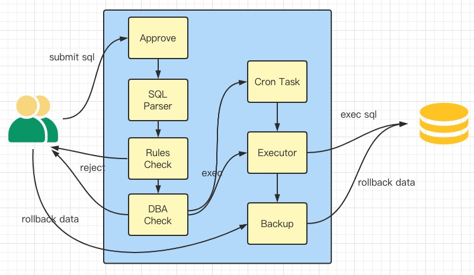

<div align="left">

**[简体中文](./doc/README-zh-CN.md) | English**

</div>

## What is Owl

Owl is a db manager platform,committed to standardizing the data, index in the database and operations to the database, to avoid risks and failures.  
capabilities which owl provides include Process approval、sql Audit、sql execute and execute as crontab、data backup and recover .



#### Features

* Process approval：approval or reject sql process order：developer submit、system check、dba check、exec sql.
* sql Audit：check sql by some rules, which are Predefined. There are rules like: standardizing name、'null' value not allowed、index match check、 data change affect lines limit, and so on. 
* sql execute and execute as crontab： After sql audit and approve, the admin can execute sql, or set a feature time to execute sql.
* data backup and recover：Before the data is changed, it will be backup, and you can recover it if something is wrong.
* submit multi sql once：we can submit multi sql once,  separate sql with ```;``` in one input box. like this: ```insert into xxxx; insert into xxxx```.

for more information [introduction](./doc/introduction.md)

## Develop and deployment

#### WEB Address

[owl_web](https://github.com/ibanyu/owl_web)

#### Dependency
* go 1.3+
* tidb or mysql

* node 
* yarn (npm)

#### Config file

* config file's location can be set by env-param("config_path") or set in main function. default location is "./config/config.yml".  
* in default value, mv '/config/config-example.yml' to '/config/config.yml' can make config work. 
* at last, still need to change config about database, env and so on.

#### DB init

* create database: ``` CREATE DATABASE `owl`; use owl ```
* create table：use mysql client connect db , copy sql in [build_table.sql](./dao/build_table.sql) and execute.
* init first admin： ``` insert into owl_admin (username,description) values ('your ldap name','first admin'); ```

#### Build and run
```
# run
make run

# run as docker container
make run-docker

# build back-end
make build

# build linux back-end
make build-linux

# build front and set to static dir
make build-front

# build docker image
make build-docker
```
 
## Roadmap

* sharding tool support (gh-ost)
* database access control
* select sql support

## Become a contributor

* Contribute to the codebase.
* Contribute to the docs.
* Report and triage bugs by issue.
* Write technical documentations and blog posts, for users and contributors.

## Community

wechat group:


## License

[Apache 2.0 License](doc/LICENSE)
